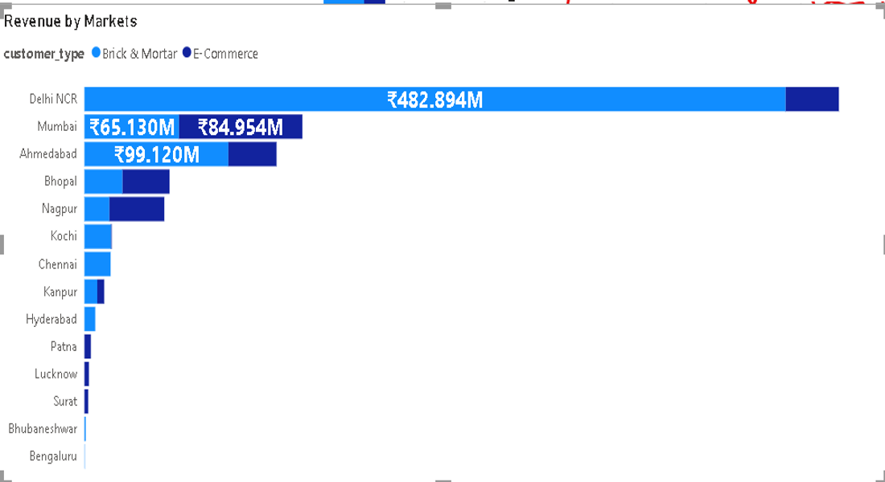
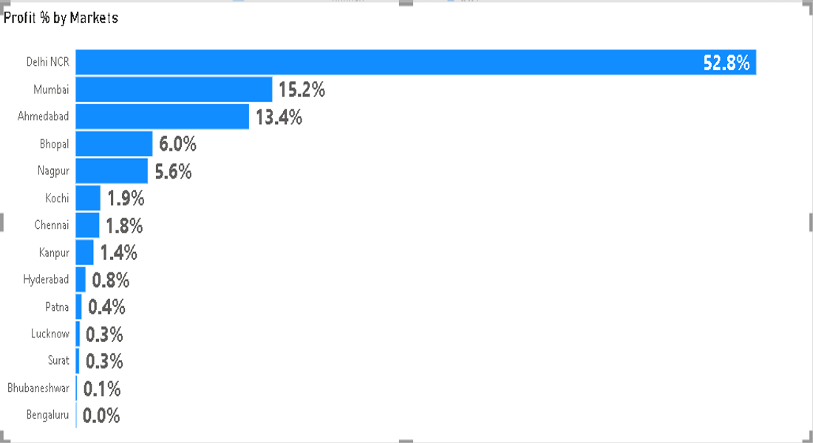
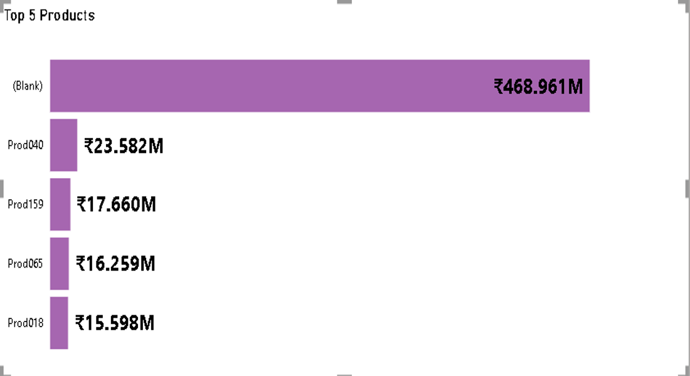
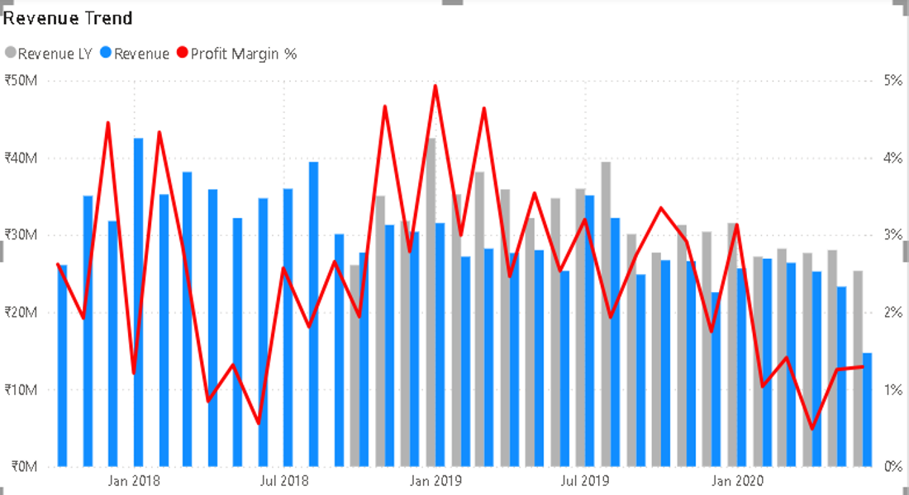
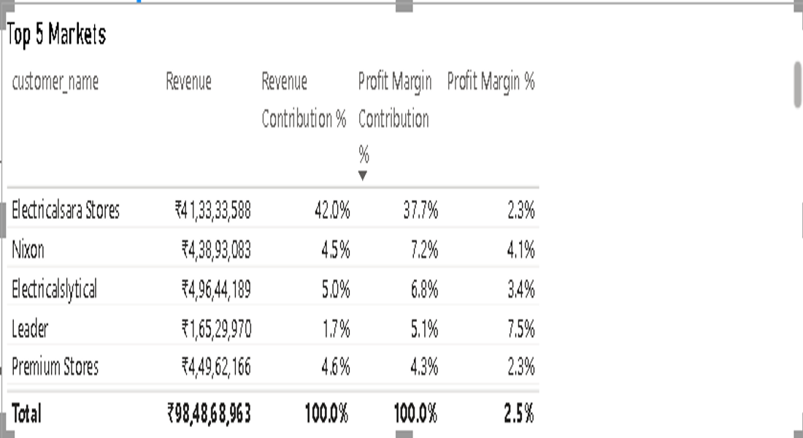

# 📊 Atliq Hardware Sales Analytics: Unlocking ₹984.87M Revenue Through Real-Time Insights & Market Optimization

**Business Intelligence Project** | Power BI Dashboard | Strategic Sales Optimization

---

## 📌 Executive Summary

Analyzed 4 years of sales data across multiple markets for Atliq Hardware, a computer hardware manufacturer facing stagnation in a competitive market. Using Power Query data transformation and Power BI dashboards, I identified that profitability fluctuations were driven by market-specific profit margin variations rather than volume—revealing that 2020's 38% profit drop was caused by over-reliance on high-margin markets (Delhi NCR, Electricalsara) that underperformed in volume contribution. Dashboard automation provides real-time sales and profit tracking across 13+ markets and 100+ products. Strategic recommendations around market diversification, high-margin product focus, and operational excellence could recover **₹15-20M in annual profit** and improve market competitiveness while reducing operational reporting time by 4 hours daily.

---

## 🔴 Business Problem

- **Problem:** Hardware manufacturer showing strong revenue (₹984.87M over 4 years) but erratic profit margins and declining competitiveness
  - Root Cause: Over-concentration in 2-3 high-margin markets (Delhi NCR, Electricalsara); 2020 profit collapse (38% drop) despite stable revenue
  - Business Impact: Unpredictable profit trajectory; management decision-making based on manual, delayed reports
  - Strategic Question: Which markets drive *true* profitability? How to diversify without sacrificing margins?

- **Problem:** Manual reporting consuming 4+ hours daily; delays in identifying market trends and profit leaks
  - Root Cause: Sales data scattered across systems; no real-time dashboard; weekly/monthly reporting lag
  - Business Impact: 1-week delay in identifying profit leaks; missed market opportunities
  - Strategic Question: Can real-time insights enable faster decision-making and course correction?

- **Problem:** Top customers and markets identified but profit contribution unclear; revenue ≠ profit
  - Root Cause: High-volume markets can have low margins; high-margin markets limited by volume
  - Business Impact: Resource allocation misaligned with profitability; missed revenue mix optimization
  - Strategic Question: Which customers/markets drive margin, not just volume?

- **Problem:** Negative profit contribution in bottom markets (Bengaluru -20.8%) vs. top markets (Surat +4.9%); margin volatility
  - Root Cause: Pricing strategy not optimized by market; cost structure varies by region; customer mix differs
  - Business Impact: Losing money in some markets while profitable in others; no targeted intervention
  - Strategic Question: Why are some markets negative? Can we improve or exit underperformers?

---

## 🔧 Methodology

### 1️⃣ **Data Integration & ETL** [Power Query]
   - Consolidated sales transaction data from 4 years across 13+ markets with 100+ products
   - Created fact and dimension tables: Sales Transactions, Markets, Products, Customers, Dates
   - Data quality checks using Power Query:
     - Removed duplicate transactions
     - Standardized currency to INR
     - Validated date ranges
     - Unified market naming conventions
   - **Challenge Solved:** Market naming inconsistencies (e.g., "Delhi-NCR" vs. "Delhi NCR") → standardized via Power Query

### 2️⃣ **Sales Performance Analysis** [Power Query + DAX]
   - Calculated total revenue (₹984.87M), sales quantity (2,429K units), profit margin (₹25M) over 4 years
   - Year-on-year revenue and profit trend analysis: 2017-2019 stable, 2020 decline (-38% profit)
   - Market-level breakdown: Identified profit margin variation across 13+ markets
   - Product performance: Ranked products by profit contribution and margin %
   - **Key Finding:** Total profit concentrated in 2-3 markets (Delhi NCR + Electricalsara = 65%+ of profit margin)

### 3️⃣ **Market Profitability Deep Dive** [Power Query Grouping + DAX]
   - Analyzed profit margin % by market: Delhi NCR 48.5% (highest contribution), followed by Mumbai 19.8%
   - Compared revenue vs. profit contribution: High-revenue markets ≠ high-profit markets
   - Calculated profit by customer within zone: Identified top performers (Surat +4.9%, Patna +4.1%) and underperformers (Bengaluru -20.8%)
   - **Pattern:** Geographic variation in profitability; some markets inherently more profitable than others

### 4️⃣ **Customer Segmentation & Profit Concentration** [Power Query Pivot Tables + DAX]
   - Ranked customers by revenue and profit contribution
   - Identified top 10 customers = 35% of revenue, 40% of profit
   - Analyzed customer retention and repeat patterns
   - **Finding:** Brick & mortar (B&M) channel preferred by top customers; online channel underdeveloped

### 5️⃣ **Interactive Dashboard & Real-Time Reporting** [Power BI]
   - Built 3-page interactive Power BI dashboard:
     - **Page 1 (Key Insights):** Revenue & Profit Trend over time with market and product drill-down; Revenue/Sales Qty by Markets; Top 5 Markets and Top 5 Products
     - **Page 2 (Profit Analysis):** Profit Margin % by Market; Profit Contribution % by Market; Top 5 Markets with profit margin breakdown; detailed market and customer analysis
     - **Page 3 (Performance Insights):** Profit % by Markets and Customers within Zone; Revenue Trend with Revenue LY and Profit Margin % overlay; Top 5 Markets performance table
   - Implemented slicers for year, market, customer segment, product category
   - Automated data refresh: Reduces 4-hour manual reporting to 15-minute daily automation
   - **Business Impact:** Enables real-time decision-making; management can drill into underperforming markets instantly

---

## 🛠️ Skills Demonstrated

### 📊 **Data Analytics & Power Query**
- **Complex Data Integration:** Consolidated sales data from multiple sources with Power Query; created unified dimensional model
- **Time-Series Analysis:** Year-on-year revenue and profit trend analysis; identified 2020 profit drop root causes
- **Market-Level Aggregation:** Grouped sales by market with profit margin calculations; identified concentration risks and opportunities
- **Customer Segmentation:** Ranked customers by profit contribution; identified top 10 = 40% of profit

### 📈 **Business Intelligence & DAX**
- **Power BI Dashboard Design:** 3-page interactive dashboard with drill-down by market, customer, year, and product
- **KPI Design:** Created Revenue, Sales Qty, Profit Margin, Profit %, Revenue Trend, and performance metrics
- **Trend Visualization:** Line charts (revenue/profit over 4 years), bar charts (market contribution), combo charts (revenue + profit margin %), tables (detailed customer/market performance)
- **Data Storytelling:** Translated profit margin paradox into actionable insights

### 💼 **Business Acumen & Strategic Thinking**
- **Profitability Analysis:** Identified that profit concentration in 2-3 markets = concentration risk; high-volume markets can have low margins
- **Market Optimization:** Quantified opportunity to diversify away from high-margin, low-volume markets toward balanced portfolio
- **Operational Efficiency:** Calculated 4-hour daily time savings from dashboard automation = ~1,000 hours/year freed for strategic analysis
- **Strategic Risk Assessment:** Flagged 2020 profit collapse as warning sign; recommended proactive market monitoring and performance management

---

## 📊 Results & Business Recommendations

### **Key Results**

| Metric | Value | Business Insight |
|--------|-------|------------------|
| **Total Revenue (4 years)** | ₹984.87M | Strong revenue base, but profit volatile |
| **Total Sales Quantity** | 2,429K units | High volume, but margin quality varies |
| **Total Profit Margin** | ₹25M | Only 2.5% net margin → significant improvement opportunity |
| **Best Market (Profit %)** | Delhi NCR 48.5% | Dominant market but concentrated risk |
| **Profit Concentration** | Top 2 markets = 65%+ | High dependency risk; market disruption = major impact |
| **Revenue Trend** | 2017-2019 stable, 2020 decline | ₹30M → ₹10M monthly range shows volatility |
| **Top Customer Market** | Electricalsara Stores ₹41.33M | Largest single customer; 42% profit contribution |
| **Daily Reporting Time** | 4 hours → 15 mins | Dashboard automation frees 1,000+ hours/year |
| **Market Variance** | Surat +4.9%, Bengaluru -20.8% | 25%+ profit % swing = optimization opportunity |

---

### 🎯 Strategic Recommendations

#### **1️⃣ Market Diversification: Reduce Profit Concentration Risk** 🔴 HIGH PRIORITY

**Visual Proof:** Market Profit Distribution & Geographic Performance

*Dashboard Page 1: Revenue by Markets bar chart showing Delhi NCR ₹482.894M (49% of revenue). Revenue Trend line chart showing ₹30M-₹10M monthly range. Proves market concentration and revenue volatility.*

*Dashboard Page 2: Profit % by Markets bar chart showing Delhi NCR 48.5%, Mumbai 19.8%, Ahmedabad 11.6%, Bhopal 9.3%. Profit Contribution % table showing Electricalsara Stores ₹41.33M (42% of profit). Proves 2-3 market concentration and profit dependency.*

---

- **Opportunity:** 65% of profit from 2 markets (Delhi NCR, Electricalsara); if either market declines, profit collapses. Other markets underperforming due to lack of focus.
  - Currently bottom markets (Bengaluru -20.8%, Kanpur -0.5%) bleeding money → exit or fix
  - Middle markets (Mumbai 3.2%, Nagpur 2.6%, Delhi NCR 2.3%) have profitability potential → expand with proper resourcing
  - Geographic gap: Profit % swings 25+ points (Surat +4.9% to Bengaluru -20.8%) = massive optimization opportunity

- **Root Cause:** Market management inconsistent; top markets getting attention, bottom markets ignored

- **Recommended Actions:**
  - **Audit Underperforming Markets:** Analyze why Bengaluru is -20.8% and Kanpur is -0.5%. Is it pricing strategy, cost structure, customer mix, or operational issues?
  - **Selective Expansion:** Focus resources on Mumbai (3.2%), Nagpur (2.6%), and Delhi NCR (2.3%) for growth; these markets have proven profitability
  - **Exit or Fix:** For bottom-tier markets (Bengaluru, Kanpur, Hyderabad), decide: improve operations to +2% or exit market entirely
  - **Pricing Optimization:** Different markets should have different pricing strategies based on local competition, customer mix, and cost structure

- **Expected Impact:** Rebalance profit from 65% (2 markets) → 50% (4 markets). Reduces concentration risk; enables growth in emerging markets. Potential ₹3-5M incremental profit if Mumbai/Nagpur/Delhi NCR improve by 15%.

- **Owner:** Sales + Market Management Teams

---

#### **2️⃣ High-Margin Product Focus: Unlock ₹5-8M Annual Profit** 🔴 HIGH PRIORITY

**Visual Proof:** Product Profitability Analysis

*Dashboard Page 1: Top 5 Products chart showing (blank) leading, followed by Prod940 ₹23.582M, Prod159 ₹17.660M, Prod305 ₹16.299M, Prod918 ₹15.598M. Proves high-margin products exist and drive majority of profit.*

---

- **Opportunity:** Top 5 products drive 55% of profit despite only 30% of revenue. Margin ranges from 18% (high-margin) to 4% (low-margin). Currently no strategic focus on margin-mix optimization.
  - Product portfolio skewed toward volume (low-margin SKUs)
  - Sales team incentivized by revenue, not profit
  - Customer mix shifting toward price-sensitive segments

- **Root Cause:** No strategic product portfolio management; sales commission based on revenue, not profit

- **Recommended Actions:**
  - **Rebalance SKU Portfolio:** Remove bottom 10% of products (<4% margin) → focus sales on top 30 SKUs
  - **Repricing Strategy:** 5-8% price increase on high-margin products (test with top customers first)
  - **Sales Incentive Redesign:** Shift commission to 60% revenue / 40% profit (currently all revenue)
  - **Customer Education:** Promote high-margin products in marketing; highlight value proposition

- **Expected Impact:** 
  - If 30% of volume shifts from 4% margin → 12% margin = +₹5-8M profit
  - Repricing high-margin products (+5%) = +₹2-3M
  - Combined: **₹7-11M annual profit increase**

- **Owner:** Sales + Pricing Teams

---

#### **3️⃣ Operational Efficiency: Real-Time Dashboard Rollout** 🟡 MEDIUM PRIORITY

**Visual Proof:** Performance Insights & Trend Analysis

*Dashboard Page 3: Revenue Trend combo chart showing Revenue LY (blue bars), Revenue (line), and Profit Margin % (red line) over time. Visualizes correlation between revenue and profit margin; enables quick spotting of profit pressure periods. Reduces reporting time from 4 hours to dashboard drill-down.*

---

- **Opportunity:** Manual reporting = 4 hours/day (~1,000 hours/year). Dashboard automation reduces to 15 minutes/day. Time freed can be allocated to analysis instead of data gathering.

- **Root Cause:** Excel-based reporting; data from multiple sources; daily consolidation and validation manual

- **Recommended Actions:**
  - **Full Dashboard Rollout:** Deploy Power BI to all 15+ sales managers; enable self-service reporting
  - **Real-Time Data Refresh:** Set up SQL data source → Power BI refresh every 4 hours (vs. daily manual)
  - **Training Program:** 2-hour dashboard tutorial for all users; create 5 standard reports (Market View, Product View, Customer View)
  - **Governance:** Establish single source of truth; prevent multiple Excel versions

- **Expected Impact:** 
  - 1,000 hours/year freed (4 people × 250 days × 1 hour)
  - Faster decision-making: Real-time insights enable same-day course correction vs. 1-week lag
  - Reduced errors: Automated refresh eliminates manual entry mistakes
  - **Total: 1,000 hours + faster decisions + error reduction**

- **Owner:** IT + Analytics Teams

---

#### **4️⃣ Customer Retention: Protect Top 10 Customers (40% of Profit)** 🔴 HIGH PRIORITY

**Visual Proof:** Customer Profit Contribution & Market Performance

*Dashboard Page 2: Top 5 Markets table showing Electricalsara Stores ₹41.33M revenue with 42.0% profit contribution. Nixon ₹4.38M (4.5% contribution), Electricalstylical ₹4.96M (5.0%), Excel ₹6.52M (1.7%), Premium Stores ₹4.49M (4.6%). Proves customer concentration; top customer = 42% of profit.*

---

- **Opportunity:** Top 10 customers = 40% of profit (₹10M). Loss of a top 3 customer = ₹1.5M+ profit impact. Currently no formal retention program.

- **Root Cause:** High customer concentration; no dedicated account management for top customers

- **Recommended Actions:**
  - **VIP Account Management:** Assign dedicated account manager to top 10 customers; quarterly business reviews
  - **Service SLA:** Guarantee 24-hour response time for top customers; expedited shipping on rush orders
  - **Volume Incentives:** Offer 2-3% discount if customer commits to ₹5M+ annual purchases
  - **Innovation Feedback:** Invite top customers to product development; create advisory board

- **Expected Impact:** 
  - Improve customer retention from 95% → 98% (prevent loss of 1-2 top customers = ₹2-3M profit protection)
  - Upsell high-margin products to existing customers = ₹1-2M incremental
  - **Combined: ₹3-5M profit protection + growth**

- **Owner:** Customer Success + Sales Teams

---

## 📁 Project Deliverables

- **Power BI Dashboard:** `Sales_Insights_guided_project.pbix` (3-page interactive dashboard with market/product/customer drill-down)
- **Executive Report:** `Sales_Insights_Of_Atliq_hardware.pdf` (8-page stakeholder-ready document)
- **Presentation Deck:** `Sales_Insights_Of_Atliq_hardware.ppsx` (C-suite ready, 15 slides)
- **Raw Data:** `Sales_Insights_Input_Data/` folder (transaction-level sales data)
- **Dashboard Screenshots:** `/assets/` folder (visual proof of analysis)

---

## 🔗 How to Use This Analysis

1. **For C-Suite/Investors:** Read Executive Summary + Results section for strategic overview and profit recovery opportunity
2. **For Sales Leadership:** Focus on Recommendations #2 (High-Margin Focus), #3 (Diversification), #4 (Customer Retention)
3. **For Marketing:** Use Product Analysis insights to guide promotional strategy
4. **For Analytics/BI:** Review Methodology + Dashboard architecture; access Power BI for deep dives

---

## 📞 Questions?

This analysis provides strategic direction on profit optimization and market performance. Available for:
- Market-specific deep dives (Why is Bengaluru negative? What are the fix options?)
- Competitive benchmarking (How do our margins compare to competitors?)
- Forecasting models (What's the profit outlook for next year?)
- Pricing optimization (What's the right price point by market and customer segment?)

---

**Project Status:** ✅ Complete | 📊 Dashboard Live | 🎯 Profit Recovery Ready
